# JestStudy

# 安裝Jest

```shell
npm init -y
```

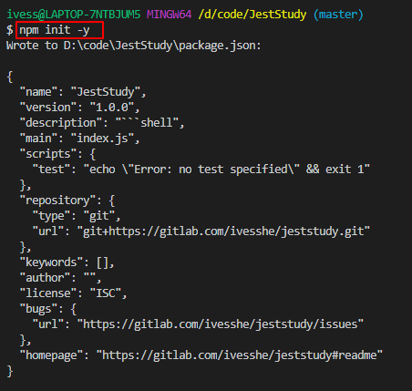

```shell
# -D參數代表在開發環境使用，會寫到devDependencies內，只有開發時才使用
npm install jest@24.8.0 -D
```

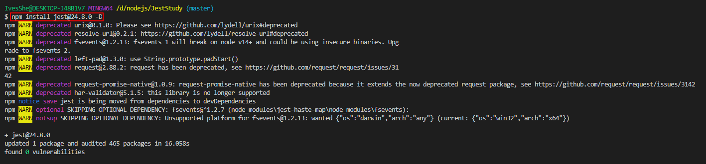

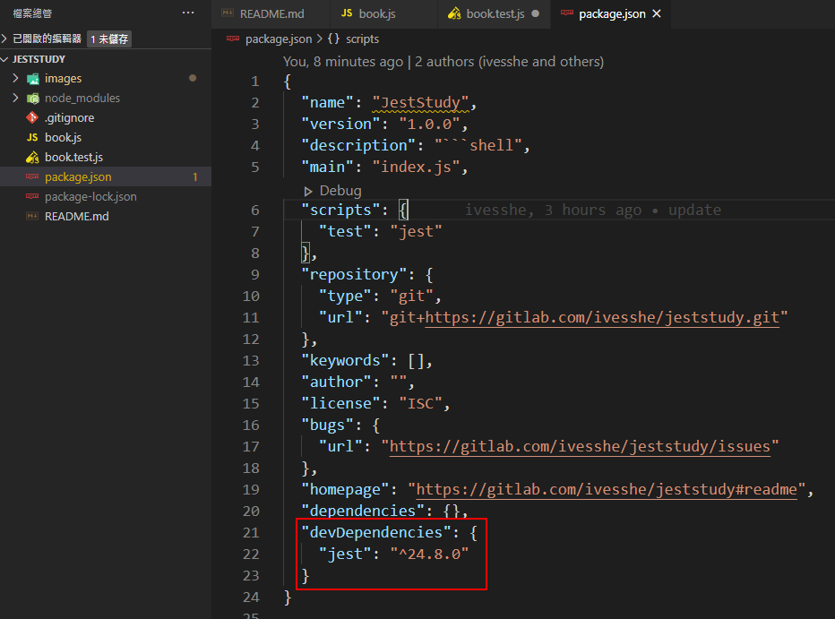

# 修改package.json

原始

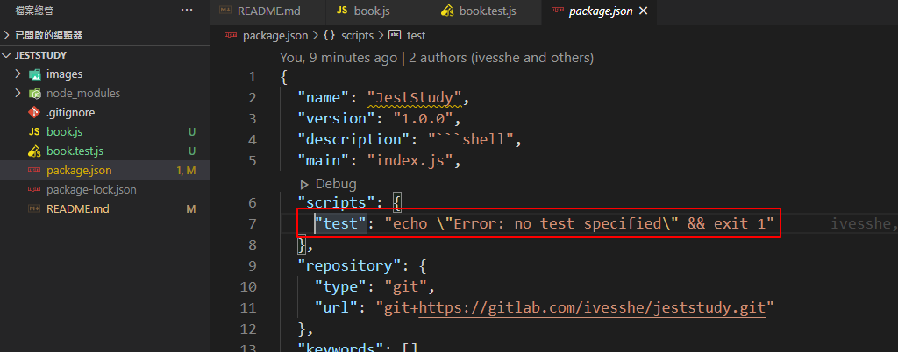

修改後

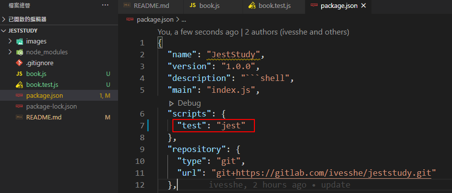

# 執行測試

```shell
npm run test
```

測試成功的畫面

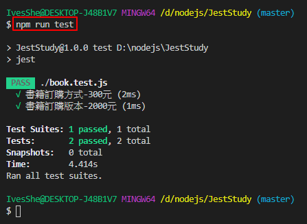

故意測試失敗的畫面

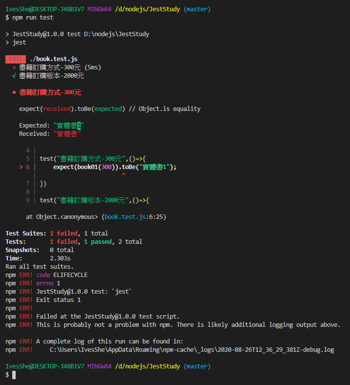

# 測試分成
- 單元測試 unit testing
- 集成測試

# 執行jest初始化配置

```shell
npx jest --init
```

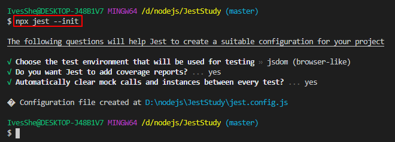

生成jest.config.js檔案

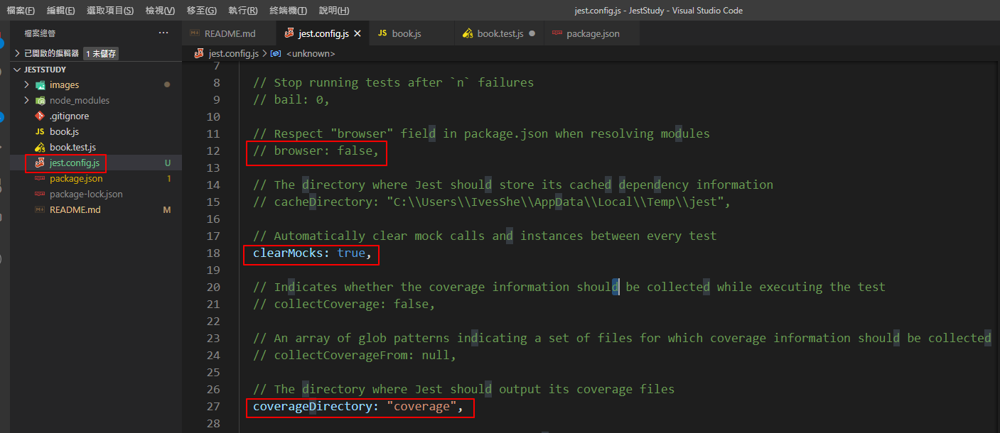

# coverage(代碼覆蓋率)

原始設定，生成測試報告的資料夾名稱

```json
coverageDirectory: "coverage",
```

```shell
npx jest --coverage
```

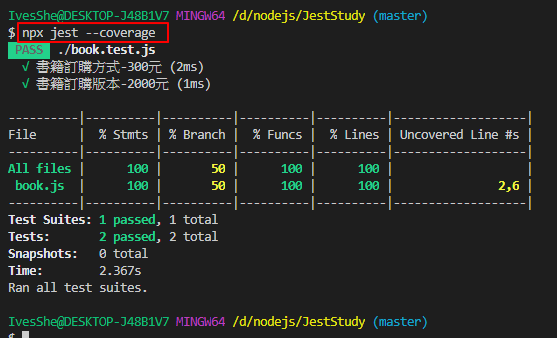

生成報告檔

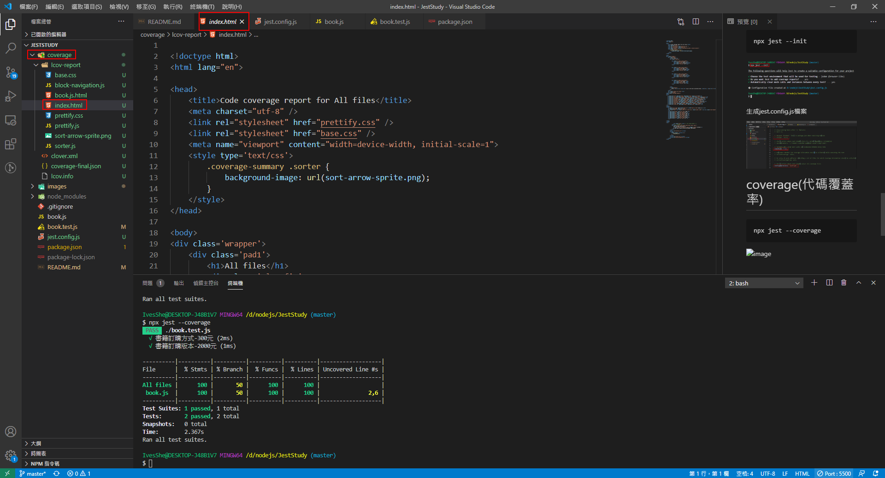

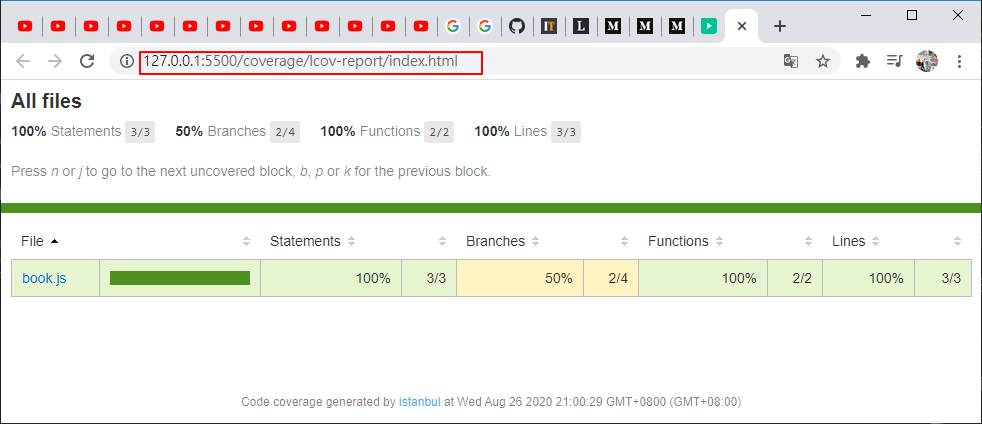

# 自訂指令

增加script

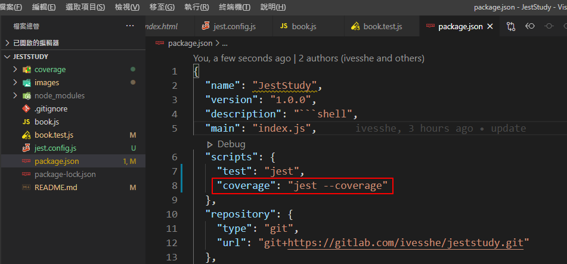

執行

```shell
num run coverage
```

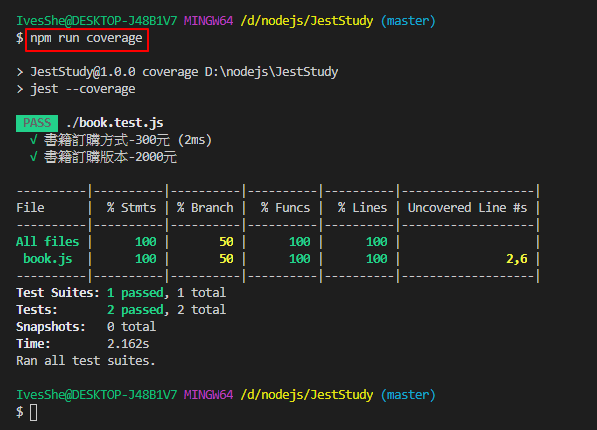