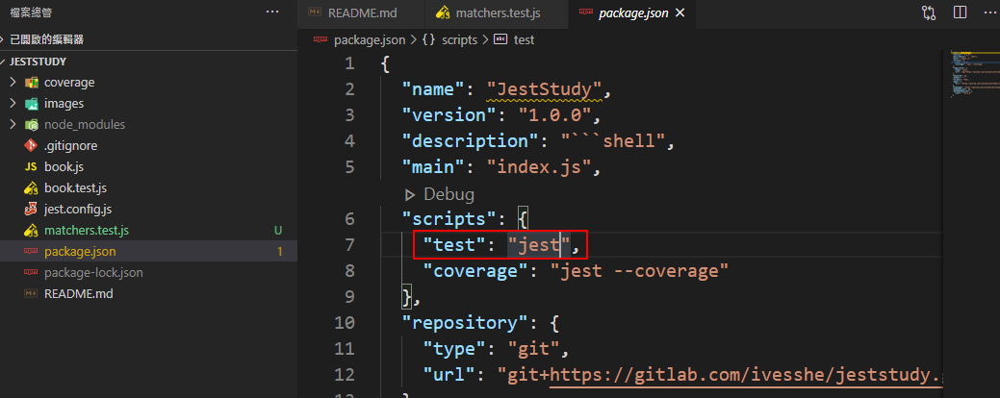
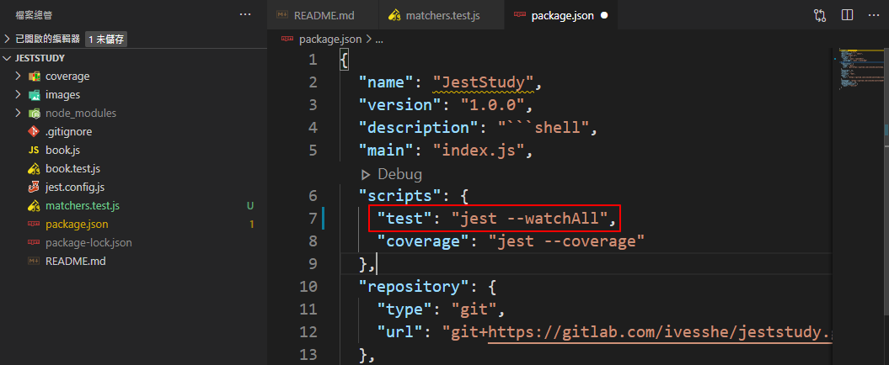
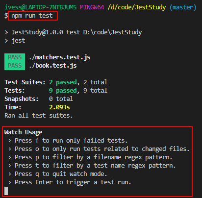
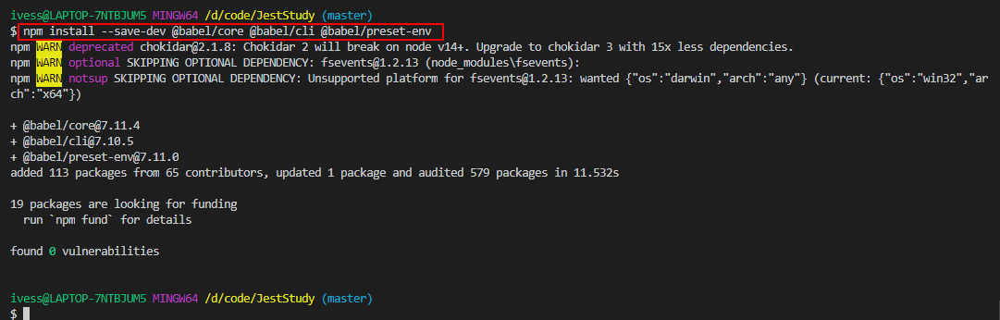
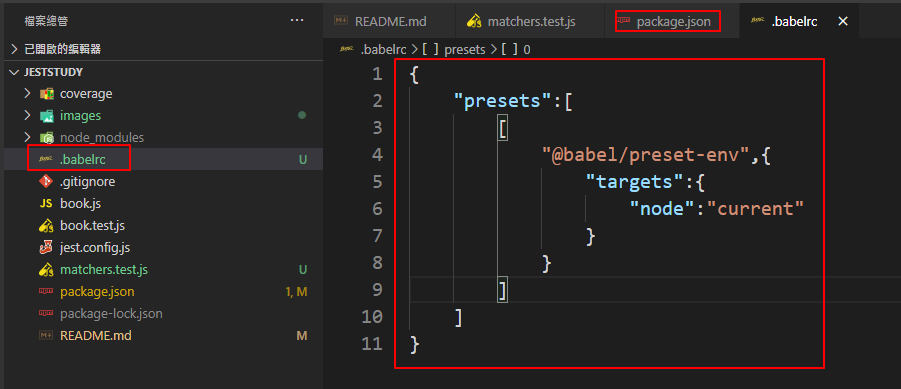
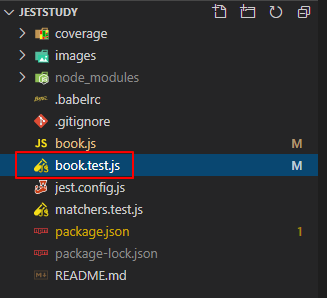
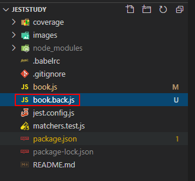
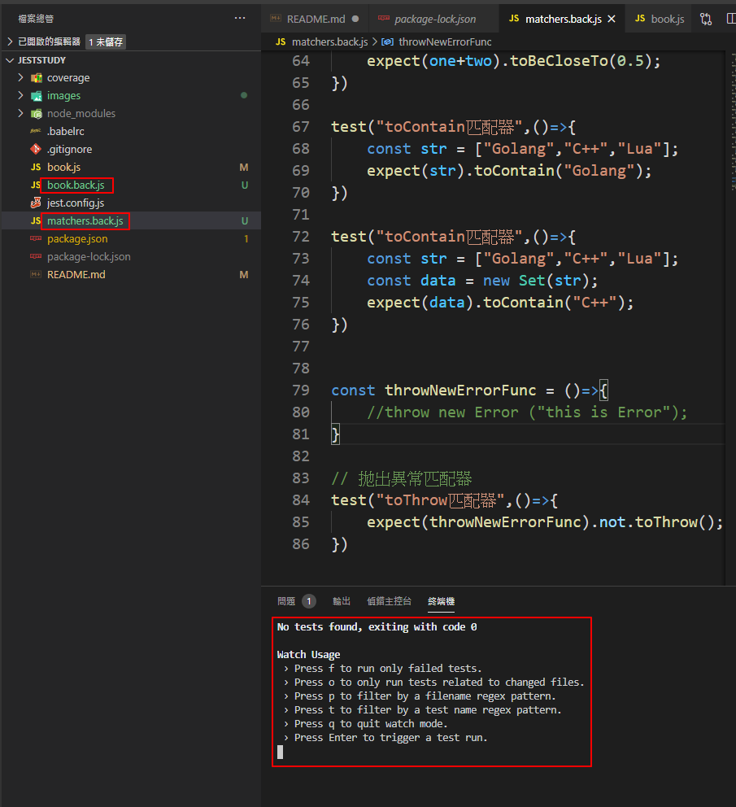
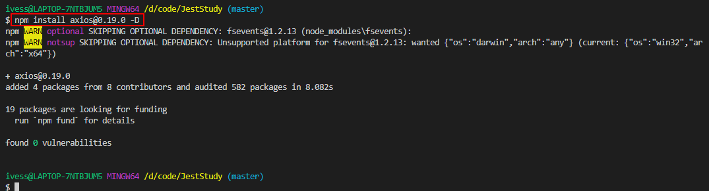
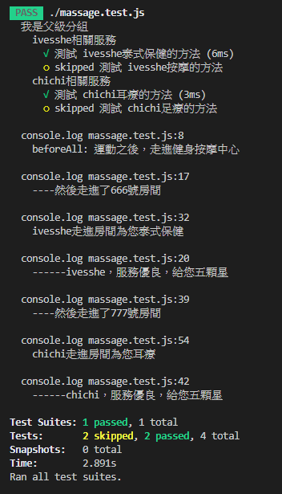

# JestStudy

# 安裝Jest

```shell
npm init -y
```


```shell
# -D參數代表在開發環境使用，會寫到devDependencies內，只有開發時才使用
npm install jest@24.8.0 -D
```


# 修改package.json

原始


修改後


# 執行測試

```shell
npm run test
```

測試成功的畫面


故意測試失敗的畫面


# 測試分成
- 單元測試 unit testing
- 集成測試

# 執行jest初始化配置

```shell
npx jest --init
```


生成jest.config.js檔案


# coverage(代碼覆蓋率)

原始設定，生成測試報告的資料夾名稱

```json
coverageDirectory: "coverage",
```

```shell
npx jest --coverage
```


生成報告檔


# 自訂指令

增加script


執行

```shell
num run coverage
```


# 匹配器

參考matchers.test.js

# 自動監聽

原設定



修改設定



執行結果，執行完不會直接退出



# 安裝babel

使程式支援ES6的語法

```shell
npm install --save-dev @babel/core @babel/cli @babel/preset-env
```



新增.babelrc檔



# 修改檔名讓該檔案先不排入test
 
修改前



修改後



修改後即不會再跑該檔案的test



# 安裝axios

```shell
npm install axios@0.19.0 -D
```



# describe 鉤子函數

可進行分組

```ts
// 加註.only，在同一組只會測式這個方法
 test.only ("測試 chichi耳療的方法",()=>{
            massage_ins.welcome(1);
            massage_ins.server_massage_ear();
            console.log(massage_ins.server);
            expect(massage_ins.server).toEqual("chichi走進房間為您耳療");       
        })
```

